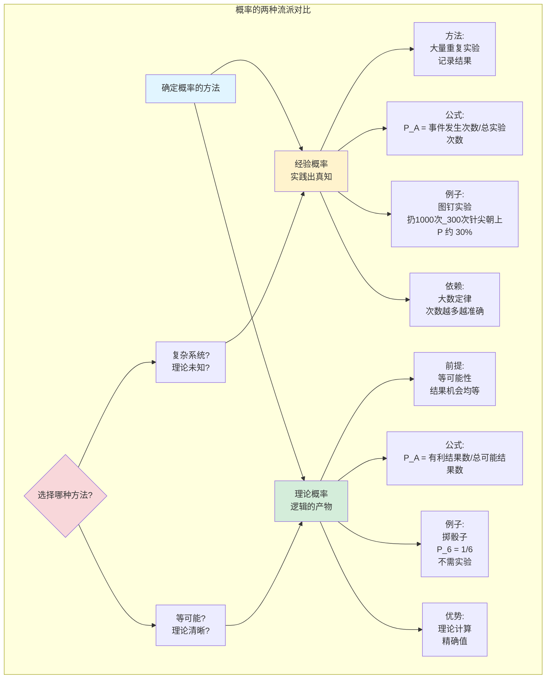
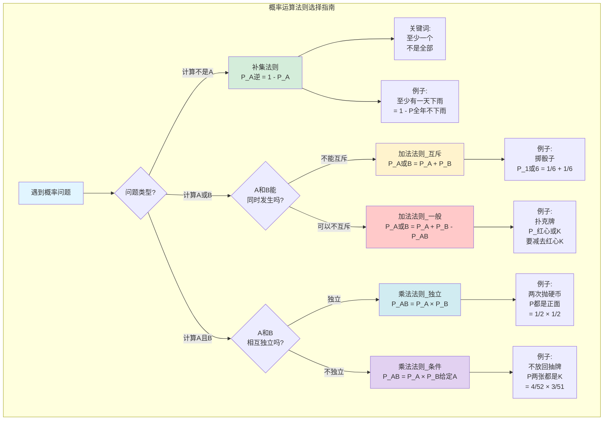
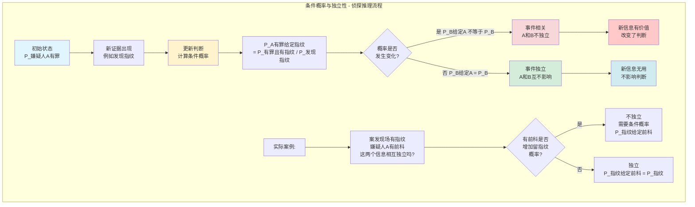
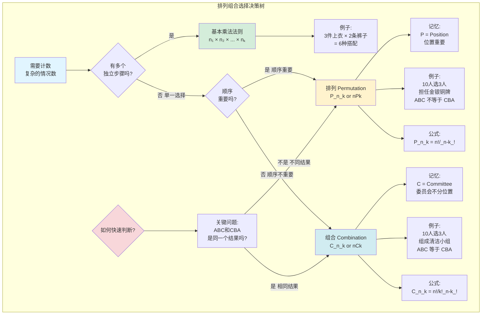

# 第四章：概率 - 赌徒的智慧与侦探的逻辑

欢迎来到统计学的核心地带——概率论. 如果说前几章是教你如何整理案发现场的线索,那么概率论就是教你**根据已有线索,判断各种可能性的大小**. 它是连接“描述”与“推断”的桥梁,是数据侦探进行逻辑推理的数学基石.

---

## 4.1 概率的两种“流派”

在探讨“可能性”时,主要有两种思路：

1.  **经验概率 (Empirical Probability)**: “实践出真知”.
    *   **定义**: 通过大量重复实验,用“事件发生的次数 / 总实验次数”来估算概率.
    *   **比喻**: 你怎么知道一个图钉扔出去,是针尖朝上还是平面倒地？你无法理论计算,只能亲手扔上1000次,然后数一数. 如果有300次针尖朝上,你就可以说针尖朝上的概率**大约**是30%.
    *   **核心**: 依赖于**大数定律 (Law of Large Numbers)**, 即当实验次数足够多时,经验概率会无限接近真实的理论概率.

2.  **理论概率 (Theoretical Probability)**: "逻辑的产物".
    *   **定义**: 在一个所有结果"机会均等"的理想实验中,一个事件的概率是"包含在该事件中的结果数 / 所有可能的结果总数".
    *   **比喻**: 掷一个公平的骰子,出现"6"的概率是多少？你知道所有可能结果是{1,2,3,4,5,6}共6种,而你想要的结果只有{6}这1种. 所以概率就是 1/6. 你不需要真的去掷骰子.
    *   **前提**: **等可能性 (Equally Likely Outcomes)**. 如果骰子被动过手脚,这个方法就不成立了.



---

## 4.2 概率世界的基本“黑话”

*   **实验 (Experiment)**: 一个结果不确定的行为,如“掷一次骰子”.
*   **结果 (Outcome)**: 实验的一次具体产出,如“掷出了4”.
*   **样本空间 (Sample Space, SS)**: **所有**可能结果的集合,如掷骰子的样本空间是 {1, 2, 3, 4, 5, 6}.
*   **事件 (Event)**: 你所关心的**一个或多个**结果的集合,如“掷出一个偶数”,其事件空间是 {2, 4, 6}.

**概率的基本公式 (理论概率):**

$P(A) = \frac{\text{事件A中的结果数量}}{\text{样本空间中的结果总数}}$

**概率的三大公理:**
1.  概率值总是在 0 和 1 之间 ($0 \le P(A) \le 1$). 0代表不可能,1代表必然发生.
2.  所有可能结果的概率加起来等于 1.
3.  如果两个事件**互斥**(不能同时发生),那么“A或B发生”的概率等于“A的概率”+“B的概率”.

---

## 4.3 概率的运算：侦探的逻辑工具箱

#### 1. 补集法则 (The Complement Rule) - “不是A”的概率

有时候,直接计算一个事件的概率很难,但计算它“不发生”的概率却很简单.

$P(A^c) = 1 - P(A)$

*   **比喻**: 计算“一年中至少有一天会下雨”的概率很复杂. 但计算它的反面——“365天**都不**下雨”的概率就容易多了. 算出来之后,用1减掉它,就是你想要的答案.
*   **关键词**: “至少一个”常常是使用补集法则的信号.

#### 2. 加法法则 (The Addition Rule) - “A或B”的概率

*   **当A和B互斥时 (Mutually Exclusive)**: A和B不能同时发生.
    *   **公式**: $P(A \text{ or } B) = P(A) + P(B)$
    *   **比喻**: 掷骰子时,一个点数“既是1又是6”是不可能的. 所以 P(1或6) = P(1) + P(6).

*   **当A和B不互斥时**: A和B可以同时发生.
    *   **公式**: $P(A \text{ or } B) = P(A) + P(B) - P(A \text{ and } B)$
    *   **比喻**: 从扑克牌中抽一张,抽到“红心或K”的概率是多少？如果你直接把“红心的概率”和“K的概率”相加,那张“红心K”就被算了两次. 所以必须减去一次“既是红心又是K”的概率.

#### 3. 乘法法则 (The Multiplication Rule) - “A和B相继发生”的概率

*   **当A和B独立时 (Independent)**: A的发生不影响B发生的概率.
    *   **公式**: $P(A \text{ and } B) = P(A) \times P(B)$
    *   **比喻**: 连续抛两次硬币,第一次的结果完全不影响第二次. 所以 P(两次都是正面) = P(第一次是正面) × P(第二次是正面).

*   **当A和B不独立时 (Dependent)**: A的发生改变了B发生的概率.
    *   **公式**: $P(A \text{ and } B) = P(A) \times P(B|A)$
    *   **$P(B|A)$** 叫做**条件概率 (Conditional Probability)**, 读作"在A发生的条件下,B发生的概率".
    *   **比喻**: 从一副牌中**不放回地**抽两张. P(两张都是K) = P(第一张是K) × P(第二张是K | 第一张已经是K了). 显然,第一张抽走K之后,牌堆里只剩51张牌和3张K,第二次抽到K的概率改变了.



---

## 4.4 条件概率与独立性 - 侦探的推理核心

**条件概率**是概率论的精髓. 它描述了**当新信息出现时,我们如何更新我们的判断**.

*   **比喻**: 一开始,你可能觉得任何一个嫌疑人犯罪的概率都很低. 但**如果**在案发现场发现了A的指纹(新信息),那么"A是凶手"的概率就会急剧上升. $P(A是凶手 | 发现A的指纹)$ 远大于 $P(A是凶手)$.

**独立性**的判断很简单：如果 $P(B|A) = P(B)$, 那么A和B就是独立的. 知道A发生了,对你判断B是否发生**毫无帮助**.



---

## 4.5 排列组合：当情况变得复杂时

当样本空间巨大时,我们不可能一个个地去数. 这时就需要“聪明地计数”. 你只需要问自己一个问题：**顺序重要吗？**

*   **排列 (Permutation)**: **顺序很重要**.
    *   **比喻**: 从10个人里选3个人分别担任金、银、铜牌得主. (A, B, C) 和 (C, B, A) 是完全不同的结果. 记作 $P_k^n$ 或 $nPk$.
    *   **口诀**: **P**ermutation, **P**osition (位置).

*   **组合 (Combination)**: **顺序不重要**.
    *   **比喻**: 从10个人里选3个人组成一个清洁小组. 选出(A, B, C)还是(C, B, A)是完全一样的,因为最终都是这三个人.
    *   **口诀**: **C**ombination, **C**ommittee (委员会).

**基本乘法法则**: 如果完成一件事需要K个步骤,第一步有 $n_1$ 种方法,第二步有 $n_2$ 种方法...第K步有 $n_k$ 种方法,那么完成整件事共有 $n_1 \times n_2 \times ... \times n_k$ 种方法.
*   **比喻**: 你有3件上衣,2条裤子,那么你有 $3 \times 2 = 6$ 种不同的搭配方法.

#### 用R计算排列组合

```r
# 排列 P(n,k): 从n个元素中选k个,顺序重要
# 例子: 从10人中选3人担任金银铜牌
# P(10,3) = 10!/(10-3)! = 10×9×8 = 720
factorial(10) / factorial(10-3)
# [1] 720

# 或使用简便方法
prod(10:8)  # 10×9×8
# [1] 720

# 组合 C(n,k): 从n个元素中选k个,顺序不重要
# 例子: 从10人中选3人组成委员会
# C(10,3) = 10!/(3!×7!)
choose(10, 3)
# [1] 120

# 或手动计算
factorial(10) / (factorial(3) * factorial(7))
# [1] 120

# 实际应用: 扑克牌问题
# 从52张牌中抽5张,有多少种可能?
choose(52, 5)
# [1] 2598960

# 基本乘法法则: 密码锁问题
# 4位数字,每位0-9,有多少种组合?
10^4
# [1] 10000
```

> **R函数说明**:
> - `choose(n, k)`: 组合数 $C_k^n$, 最常用!
> - `factorial(n)`: 计算 $n!$
> - `prod(a:b)`: 计算连续乘积 $a \times (a+1) \times ... \times b$



现在,你已经掌握了概率这个强大的工具,可以开始量化未知,进行真正的逻辑推断了. 下一章,我们将学习"随机变量"及其概率分布,为更高级的统计模型铺平道路.
