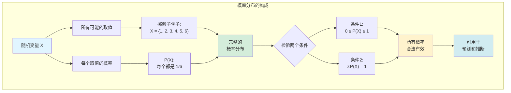
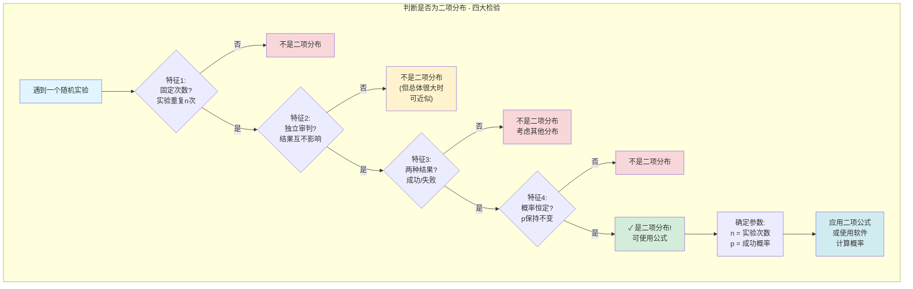
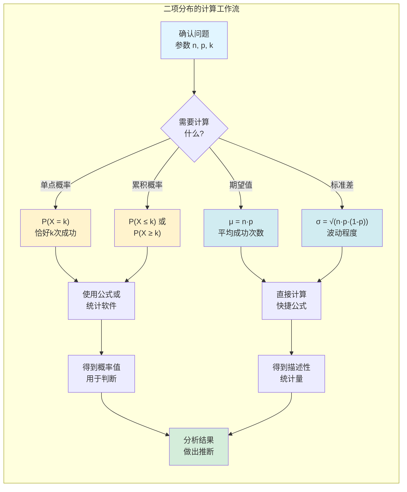
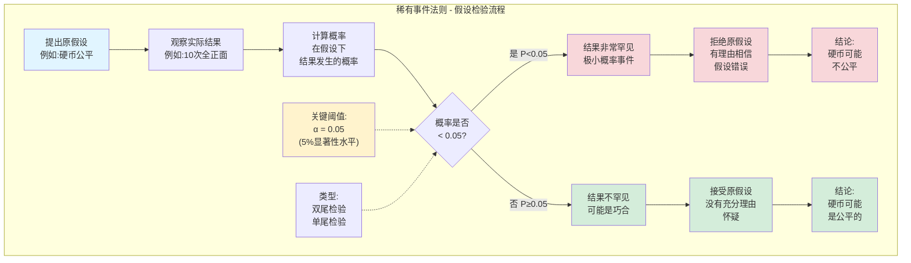

# 第五章：离散概率分布 - 侦探的标准化作案手法(M.O.)分析手册

在之前的章节中,我们学会了描述数据和计算单一事件的概率. 现在,我们要将两者结合,进入一个更高级的领域：**概率分布**. 这就像一个资深侦探,不再满足于分析单条线索,而是开始总结罪犯的“作案手法”(Modus Operandi, M.O.),形成系统性的档案.

---

## 5.1 什么是随机变量和概率分布？

*   **随机变量 (Random Variable)**: 一个其数值由随机事件决定的变量. 我们通常用大写字母 $X$ 表示.
    *   **比喻**: 你掷一个骰子,“掷出的点数”就是一个随机变量 $X$. $X$ 的可能取值是 {1, 2, 3, 4, 5, 6}.
    *   **离散随机变量**: 变量的取值是可数的,有明确的间隙(比如,家庭中的孩子人数,只能是0, 1, 2, ...).

*   **概率分布 (Probability Distribution)**: 一份详细的“档案”,记录了一个随机变量**所有可能取值**以及**每个取值对应的概率**.
    *   **比喻**: 对于掷骰子实验,它的概率分布就是:

| X (点数) | P(X) (概率) |
| :---: | :---: |
| 1 | 1/6 |
| 2 | 1/6 |
| 3 | 1/6 |
| 4 | 1/6 |
| 5 | 1/6 |
| 6 | 1/6 |

        这张表格(或其对应的图形)就是一个完整的概率分布. 它满足两个条件: 1) 所有概率都在0和1之间; 2) 所有概率加起来等于1.

#### 概率分布的“数字档案”：期望值与标准差

对于一份概率分布,我们同样可以计算它的“重心”和“胖瘦”:

*   **期望值 (Expected Value), $E(X)$**: 这就是概率分布的**平均数($\mu$)**. 它告诉你,在大量重复实验后,你“期望”得到的平均结果是多少.
    *   **比喻**: 在赌场里,一个游戏的“期望值”如果是-0.5元,意味着你每玩一把,平均下来会输掉5毛钱. 期望值是衡量一个赌局是否“划算”的黄金标准.
    *   **计算**: $E(X) = \mu = \sum [x \cdot P(x)]$. (每个取值乘以其对应的概率,然后求和)

*   **方差($\sigma^2$)和标准差($\sigma$)**: 和第三章一样,它们衡量了数据围绕期望值的波动程度. 计算方法类似,只是加入了概率作为“权重”.

---

## 5.2 二项分布：最常见的“作案手法”

在现实世界中,有无数的随机事件,但其中一种“作案手法”反复出现,我们称之为**二项分布 (Binomial Distribution)**. 如果一个实验满足以下四个条件,那它就属于二项分布,我们可以用非常方便的“标准公式”来分析它.

#### 二项分布的四大特征 (The Four Commandments):

1.  **固定次数 (Fixed number of trials)**: 实验被重复了固定的 $n$ 次.
    *   *例子*: 抛硬币10次 ($n=10$), 抽查20个产品 ($n=20$). 

2.  **独立审判 (Independent trials)**: 每次实验的结果互不影响.
    *   *例子*: 这次抛硬币是正面,不影响下一次的结果. (注意: **不放回**的抽样严格来说是不独立的,但如果总体很大,样本很小,我们可以近似看作独立).

3.  **两种结果 (Two outcomes)**: 每次实验只有两种可能的结果,我们习惯性地称之为“成功”和“失败”.
    *   *例子*: 抛硬币(正面/反面),产品检验(合格/不合格),投篮(命中/未中).
    *   **注意**: “成功”不一定代表好事. 如果你在研究次品率,“出现一个次品”就是“成功”.

4.  **概率恒定 (Probability of success is constant)**: 每次实验中,"成功"的概率 $p$ 都是相同的.
    *   *例子*: 每次抛硬币,正面的概率总是0.5.

#### 使用二项分布

如果一个场景满足以上四点,我们就可以用二项概率公式来计算“在n次实验中,恰好发生k次成功”的概率:

$P(X=k) = C_k^n \cdot p^k \cdot (1-p)^{n-k}$

*   $n$: 总实验次数
*   $k$: 我们关心的“成功”次数
*   $p$: 单次实验的成功概率
*   $C_k^n$: 组合数,代表“从n次中选出k次成功”有多少种组合方式.

> **好消息**: 你不需要手动计算这个复杂的公式! 任何统计软件(包括R)都可以帮你轻松完成. 你只需要告诉它 $n$, $p$, 和 $k$ 是多少.

#### 二项分布的期望值和标准差 (快捷方式)

对于二项分布,计算期望值和标准差有极其简单的公式：

*   **期望值**: $\mu = n \cdot p$
    *   *例子*: 你抛一个公平的硬币100次(n=100, p=0.5),你期望得到多少个正面? 答案是 $100 \times 0.5 = 50$ 个.
*   **标准差**: $\sigma = \sqrt{n \cdot p \cdot (1-p)}$

---

## 5.3 “不寻常事件”的判断准则

概率分布给了我们一个强大的工具,去判断一个事件是否“不寻常”.

**稀有事件法则 (Rare Event Rule)**:

> 如果在一个给定的假设下,某个特定观测事件发生的概率极小,那么我们就有理由相信,当初的那个假设是错误的.

*   **比喻**: 你朋友声称他的硬币是公平的(假设). 但他连续抛了10次,结果全是正面. “连续10次正面”这个事件在“硬币公平”的假设下,概率是极其微小的($0.5^{10} \approx 0.001$). 于是,你就有充分的理由怀疑他的**假设**——“这枚硬币是公平的”——很可能是错的.

在实践中,我们通常设定一个“小概率”的阈值,最常用的是 **5% (或0.05)**.

*   如果 $P(X \ge k) < 0.05$, 我们就说"观测到k次或更多成功"是一个**不寻常的高**事件.
*   如果 $P(X \le k) < 0.05$, 我们就说"观测到k次或更少成功"是一个**不寻常的低**事件.

> **注意**: 我们关心的是 $P(X \ge k)$ 或 $P(X \le k)$, 而不是 $P(X=k)$. 因为只发生"正好k次"的概率通常都很小,我们需要考虑的是"发生至少那么极端情况"的累积概率.

这一章为你打开了通往"统计推断"的大门. 通过理解概率分布,特别是二项分布,你现在已经能对一个随机事件是否"正常"做出有理有据的判断了. 下一章,我们将探讨连续型随机变量及其最重要的分布——正态分布.
