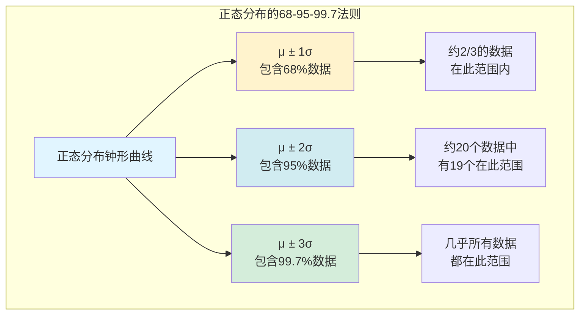
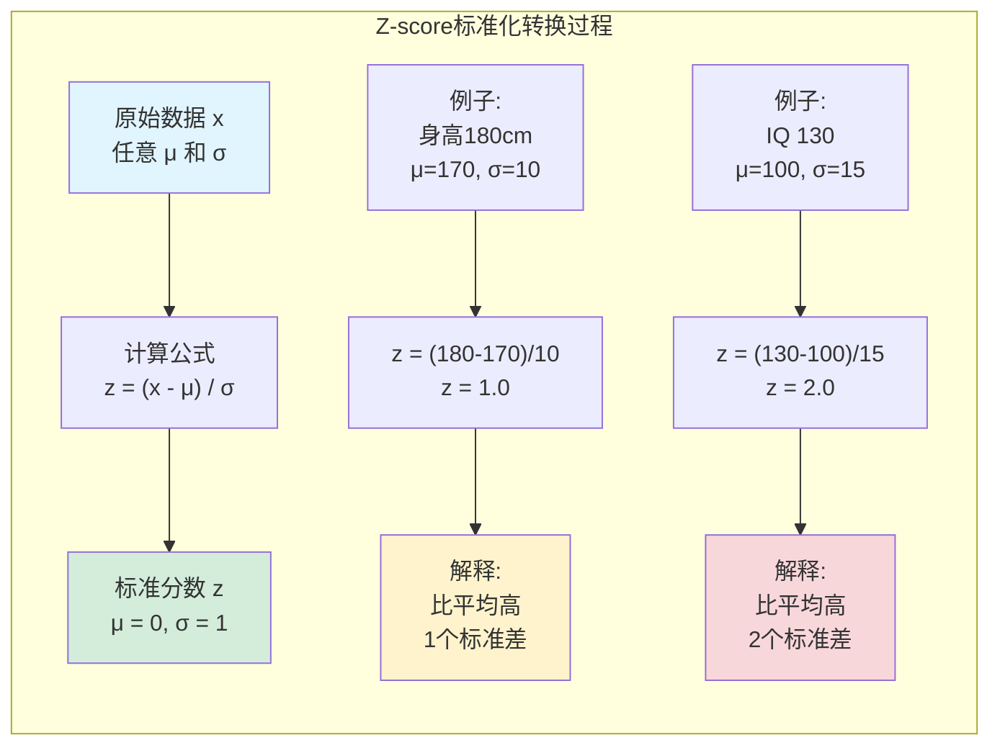
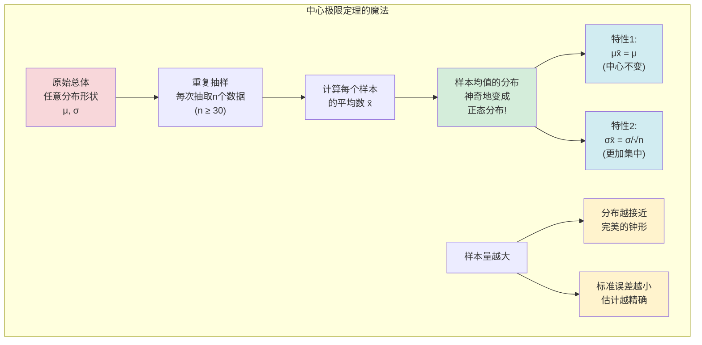
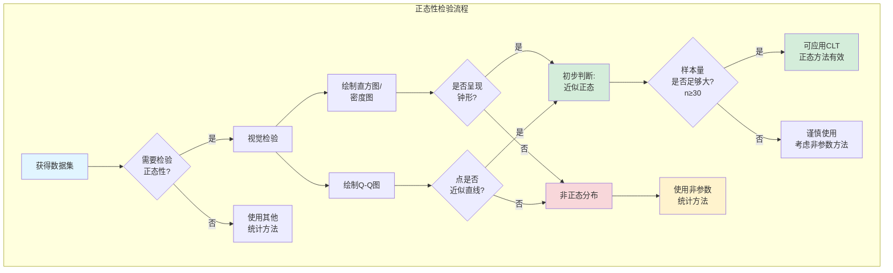

# 第六章：正态分布与中心极限定理 - 宇宙的钟形曲线与侦探的终极法宝

上一章我们学习了离散的概率分布,就像数台阶一样. 但现实中更多的数据是连续的,比如身高、体重、时间,它们可以在一个区间内取任何值. 这一章,我们将探索连续数据的世界,并认识统计学中最重要、最迷人的一个概念——**正态分布**,以及赋予它魔力的**中心极限定理**.

---

## 6.1 连续概率分布

对于连续型随机变量,我们不再讨论“某个单点”的概率(因为理论上它是零),而是讨论“某个**区间**”的概率.

*   **比喻**: 想想你的身高. 你身高“正好”是175.00000...厘米的概率是0. 但你身高“在174厘米到176厘米之间”的概率是存在的.
*   **概率的表示**: 在连续分布中,概率由**曲线下的面积**来表示. 整个曲线下的总面积等于1(或100%).

## 6.2 正态分布：大自然的“偏爱”

在自然界和人类社会中,无数现象的数据分布都呈现出一种中间高、两边低、左右对称的“钟形”——这就是**正态分布 (Normal Distribution)**. 从人类的身高、血压,到考试成绩、测量误差,似乎都遵循着这个规律.

#### 正态分布的特征:

*   它是一个完美的**钟形曲线**.
*   **对称**: 分布的平均数($\mu$)、中位数和众数都位于中心同一点.
*   由两个参数完全决定: **平均数 $\mu$** (决定钟的中心位置) 和 **标准差 $\sigma$** (决定钟的“胖瘦”). $\sigma$ 越大,钟越“矮胖”,数据越分散; $\sigma$ 越小,钟越“高瘦”,数据越集中.

#### 经验法则 (The Empirical Rule) - 68-95-99.7法则

对于任何正态分布,都有一个神奇的规律:

*   约 **68%** 的数据落在平均数周围 **1个标准差** 的范围内 ($\mu \pm 1\sigma$).
*   约 **95%** 的数据落在平均数周围 **2个标准差** 的范围内 ($\mu \pm 2\sigma$).
*   约 **99.7%** 的数据落在平均数周围 **3个标准差** 的范围内 ($\mu \pm 3\sigma$).

这个法则为我们快速估计数据范围提供了一个强大的心算工具.

#### Z-score: 标准化的力量

为了能比较不同正态分布(比如比较一个身高1米8的人和一个IQ130的人谁更"出众"),我们需要一个统一的"度量衡". 这就是**Z-score (标准分)**.

$z = \frac{x - \mu}{\sigma}$

*   **含义**: Z-score衡量的是一个原始数据点 $x$ 距离它的平均数 $\mu$ 有多少个**标准差**的距离.
*   **标准化**: 任何一个普通正态分布,通过Z-score转换,都会变成一个**标准正态分布 (Standard Normal Distribution)**. 这个标准版的"钟",其平均数 $\mu=0$, 标准差 $\sigma=1$.

> **侦探应用**: 计算Z-score就像是把不同案件的线索都转换成一种标准格式,便于比较其"罕见程度". 一个Z-score为+3的线索,无论在什么案件中,都意味着"极其罕见".

---

## 6.3 中心极限定理：统计学的“魔法”

现在,我们迎来统计学中最令人惊叹的定理——**中心极限定理 (Central Limit Theorem, CLT)**. 它简直就像是统计世界里的魔法.

**定理内容**: 不管原始总体的数据分布**长什么样**(无论是偏态、均匀分布还是奇形怪状),只要我们从中反复抽取**足够大**的样本(通常认为 $n \ge 30$ 即可),那么这些**样本的平均数($\bar{x}$)** 将会形成一个**近似正态分布**.

**这个新形成的正态分布还有两个神奇的特性:**
1.  它的中心(均值)就等于原始总体的均值: $\mu_{\bar{x}} = \mu$.
2.  它的标准差(称为**标准误差, Standard Error**)变得更小了: $\sigma_{\bar{x}} = \frac{\sigma}{\sqrt{n}}$.

#### 中心极限定理的伟大意义

*   **比喻**: 想象一个装满了各种形状石子的巨大仓库(总体分布未知). 你每次随机抓一大把石子(一个大样本),计算这把石子的平均重量($\bar{x}$),然后把这个平均重量记录下来. 你重复这个动作成千上万次. 中心极限定理告诉你,你记录下来的这些“平均重量”的分布,将会是一个非常漂亮的钟形曲线!

*   **侦探的终极法宝**: 这个定理意味着,即使我们对一个案件的总体情况(比如全体市民的意见分布)一无所知,我们也可以通过分析一个样本的平均值来进行可靠的推断. 因为我们知道,**样本平均数**这个**统计量**本身的行为是可预测的(它服从正态分布). 这为我们从样本推断总体的所有高级技术(如置信区间、假设检验)铺平了道路.

#### 如何判断数据是否"正态"?

在应用正态分布的性质前,我们得先判断数据是否近似正态. 常用方法有两种:

1.  **画密度图或直方图**: 看它是否大致呈现"钟形".
2.  **正态分位数图 (Normal Quantile Plot, or Q-Q Plot)**: 这是一种更专业的工具. 如果图上的点大致分布在一条直线上,那么数据就可能来自一个正态分布.

这一章的内容是整个统计推断的基石. 理解了正态分布的普遍性和中心极限定理的魔力,你就掌握了数据侦探手中最强大的武器. 从此,我们可以胸有成竹地从"样本"这个冰山一角,去推断"总体"那片广阔的未知水域了.
