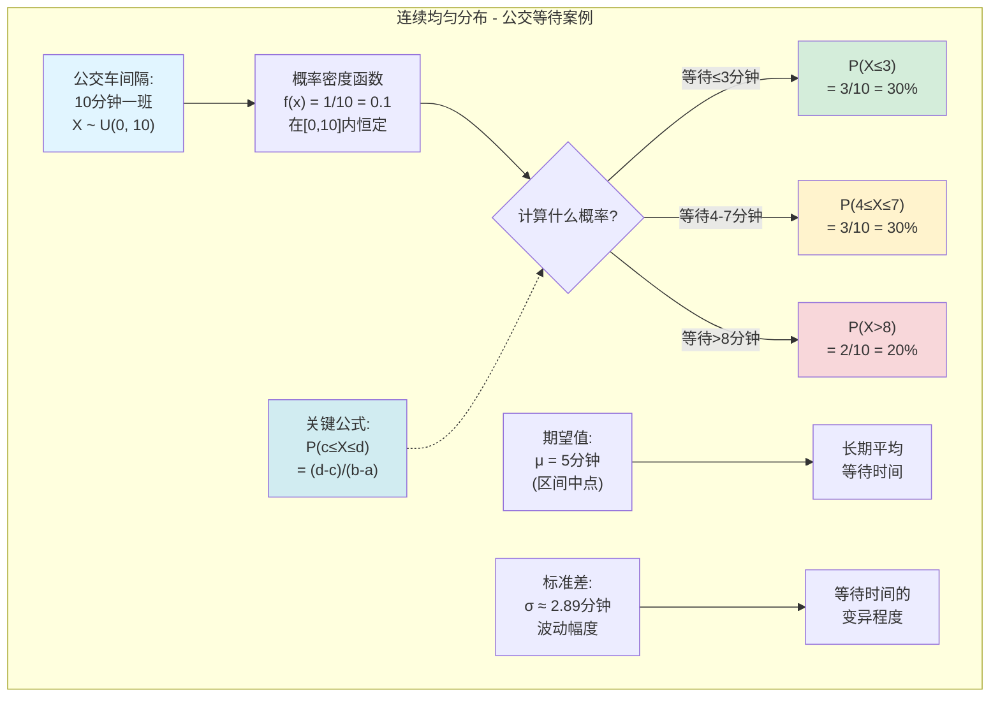
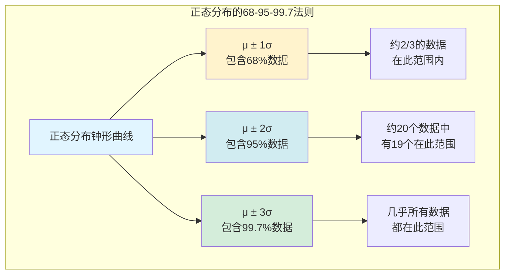
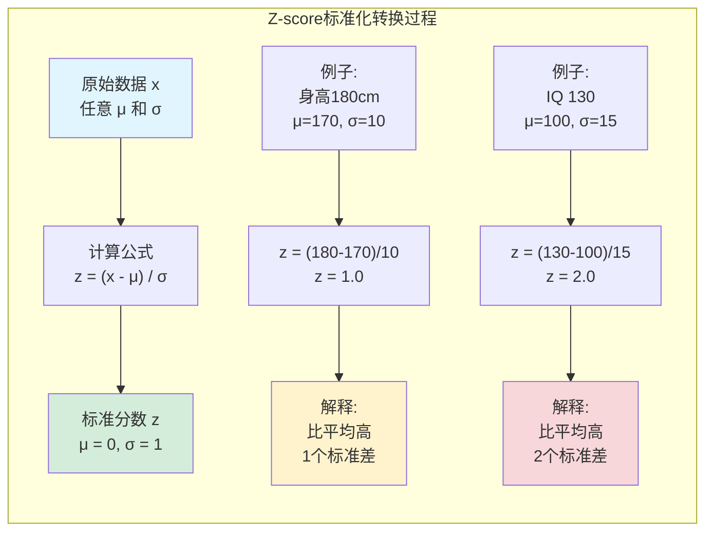
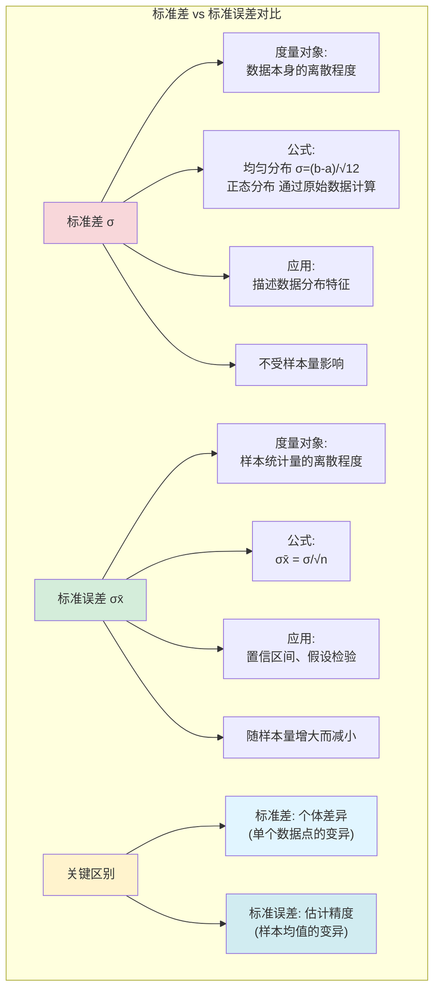
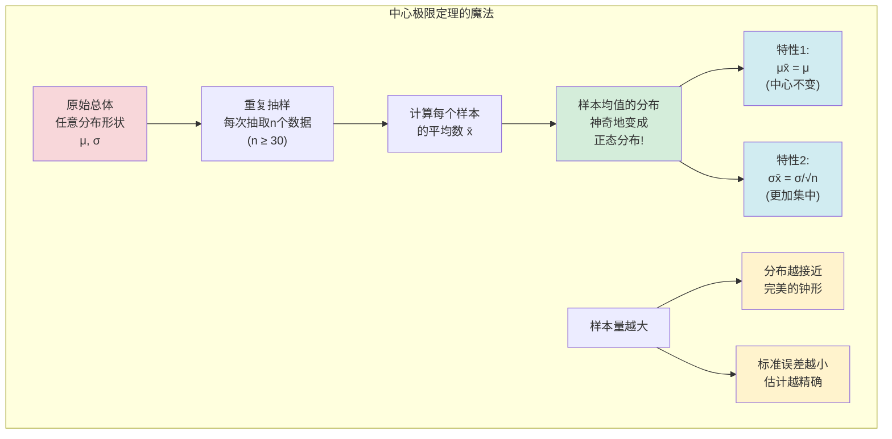
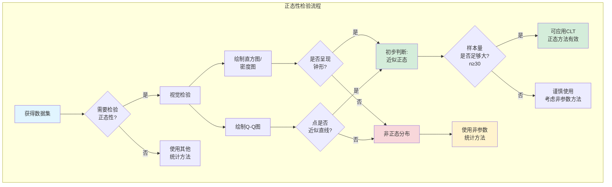

# 第六章：正态分布与中心极限定理 - 宇宙的钟形曲线与侦探的终极法宝

上一章我们学习了离散的概率分布,就像数台阶一样. 但现实中更多的数据是连续的,比如身高、体重、时间,它们可以在一个区间内取任何值. 这一章,我们将探索连续数据的世界,并认识统计学中最重要、最迷人的一个概念——**正态分布**,以及赋予它魔力的**中心极限定理**.

---

## 6.1 连续概率分布

对于连续型随机变量,我们不再讨论"某个单点"的概率(因为理论上它是零),而是讨论"某个**区间**"的概率.

*   **比喻**: 想想你的身高. 你身高"正好"是175.00000...厘米的概率是0. 但你身高"在174厘米到176厘米之间"的概率是存在的.
*   **概率的表示**: 在连续分布中,概率由**曲线下的面积**来表示. 整个曲线下的总面积等于1(或100%).

### 6.1.1 连续均匀分布：最简单的连续分布

在进入复杂的正态分布之前,让我们先认识一个最简单的连续概率分布——**连续均匀分布 (Continuous Uniform Distribution)**. 这是一个"完全公平"的分布,在给定区间内,每个值出现的概率都相等.

#### 定义与特征

**连续均匀分布**记作 $X \sim U(a, b)$,其中 $a$ 是最小值,$b$ 是最大值.

**概率密度函数 (PDF)**:

$$f(x) = \begin{cases}
\frac{1}{b-a} & \text{当 } a \le x \le b \\
0 & \text{其他情况}
\end{cases}$$

**核心公式**:

*   **区间概率**: 计算随机变量落在区间 $[c, d]$ 内的概率:

    $$P(c \le X \le d) = \frac{d - c}{b - a}$$

    其中 $a \le c \le d \le b$

*   **期望值(平均数)**: $\mu = \frac{a + b}{2}$ (就是区间的中点)

*   **标准差**: $\sigma = \frac{b - a}{\sqrt{12}} \approx \frac{b - a}{3.464}$

#### 实际案例：公交车等待时间

> **情景**: 你每天早上去某个公交站等车. 根据时刻表,公交车每隔10分钟一班,但你不知道上一班车什么时候走的. 那么你的**等待时间**就服从连续均匀分布.

**案例设定**:
*   等待时间 $X$ 在 0 到 10 分钟之间均匀分布
*   $X \sim U(0, 10)$
*   任何时刻到达,等待时间都是"完全随机"的

**问题1**: 等待时间**不超过3分钟**的概率是多少?

$$P(X \le 3) = P(0 \le X \le 3) = \frac{3 - 0}{10 - 0} = \frac{3}{10} = 0.3 = 30\%$$

> **解读**: 有30%的机会,你只需等待3分钟或更短时间.

**问题2**: 等待时间**在4到7分钟之间**的概率是多少?

$$P(4 \le X \le 7) = \frac{7 - 4}{10 - 0} = \frac{3}{10} = 0.3 = 30\%$$

> **解读**: 有30%的机会,你的等待时间会落在4-7分钟这个区间.

**问题3**: 等待时间**超过8分钟**的概率是多少?

$$P(X > 8) = P(8 \le X \le 10) = \frac{10 - 8}{10 - 0} = \frac{2}{10} = 0.2 = 20\%$$

> **解读**: 有20%的机会,你需要等待8分钟以上. 真倒霉!

**问题4**: 平均等待时间是多少?

$$\mu = \frac{a + b}{2} = \frac{0 + 10}{2} = 5 \text{ 分钟}$$

> **解读**: 如果你每天都去等车,长期平均下来,你的等待时间是5分钟.

**问题5**: 等待时间的标准差是多少?

$$\sigma = \frac{b - a}{\sqrt{12}} = \frac{10 - 0}{\sqrt{12}} = \frac{10}{3.464} \approx 2.89 \text{ 分钟}$$

> **解读**: 大部分时候,你的等待时间会在平均值上下浮动约2.89分钟.

#### 用R实现连续均匀分布计算

```r
# 连续均匀分布 U(0, 10)
# 问题1: P(X ≤ 3)
punif(3, min=0, max=10)
# [1] 0.3

# 问题2: P(4 ≤ X ≤ 7)
punif(7, 0, 10) - punif(4, 0, 10)
# [1] 0.3

# 问题3: P(X > 8) = 1 - P(X ≤ 8)
1 - punif(8, 0, 10)
# [1] 0.2

# 问题4和5: 期望值和标准差
# 期望值 μ = (a+b)/2
(0 + 10) / 2
# [1] 5

# 标准差 σ = (b-a)/√12
(10 - 0) / sqrt(12)
# [1] 2.886751
```

> **R函数说明**:
> - `punif(q, min, max)`: 累积概率函数(CDF),计算 $P(X \le q)$
> - `dunif(x, min, max)`: 概率密度函数(PDF),在均匀分布中返回 $1/(b-a)$



#### 均匀分布的实际应用

连续均匀分布在日常生活中随处可见:

*   **等待时间**: 电梯到达、公交到站、客服接通
*   **随机抽取**: 在一段时间内随机选择一个时刻
*   **测量误差**: 某些四舍五入产生的误差
*   **随机数生成**: 计算机生成 $[0,1]$ 之间的随机数
*   **物理现象**: 某些匀速运动物体的位置预测

> **侦探应用**: 如果一个犯罪分子在某个时间段内随机作案,而你不知道具体时间分布,均匀分布可以作为你的"最保守估计"——假设每个时刻的可能性相同.

---

## 6.2 正态分布：大自然的"偏爱"

在自然界和人类社会中,无数现象的数据分布都呈现出一种中间高、两边低、左右对称的“钟形”——这就是**正态分布 (Normal Distribution)**. 从人类的身高、血压,到考试成绩、测量误差,似乎都遵循着这个规律.

#### 正态分布的特征:

*   它是一个完美的**钟形曲线**.
*   **对称**: 分布的平均数($\mu$)、中位数和众数都位于中心同一点.
*   由两个参数完全决定: **平均数 $\mu$** (决定钟的中心位置) 和 **标准差 $\sigma$** (决定钟的“胖瘦”). $\sigma$ 越大,钟越“矮胖”,数据越分散; $\sigma$ 越小,钟越“高瘦”,数据越集中.

#### 经验法则 (The Empirical Rule) - 68-95-99.7法则

对于任何正态分布,都有一个神奇的规律:

*   约 **68%** 的数据落在平均数周围 **1个标准差** 的范围内 ($\mu \pm 1\sigma$).
*   约 **95%** 的数据落在平均数周围 **2个标准差** 的范围内 ($\mu \pm 2\sigma$).
*   约 **99.7%** 的数据落在平均数周围 **3个标准差** 的范围内 ($\mu \pm 3\sigma$).

这个法则为我们快速估计数据范围提供了一个强大的心算工具.



#### Z-score: 标准化的力量

为了能比较不同正态分布(比如比较一个身高1米8的人和一个IQ130的人谁更"出众"),我们需要一个统一的"度量衡". 这就是**Z-score (标准分)**.

$z = \frac{x - \mu}{\sigma}$

*   **含义**: Z-score衡量的是一个原始数据点 $x$ 距离它的平均数 $\mu$ 有多少个**标准差**的距离.
*   **标准化**: 任何一个普通正态分布,通过Z-score转换,都会变成一个**标准正态分布 (Standard Normal Distribution)**. 这个标准版的"钟",其平均数 $\mu=0$, 标准差 $\sigma=1$.



> **侦探应用**: 计算Z-score就像是把不同案件的线索都转换成一种标准格式,便于比较其"罕见程度". 一个Z-score为+3的线索,无论在什么案件中,都意味着"极其罕见".

#### 用R计算Z-score和正态分布概率

```r
# 例子1: 身高数据 (μ=170, σ=10)
# 计算身高180cm的Z-score
z1 <- (180 - 170) / 10
z1
# [1] 1

# 例子2: IQ数据 (μ=100, σ=15)
# 计算IQ 130的Z-score
z2 <- (130 - 100) / 15
z2
# [1] 2

# 标准正态分布: 计算概率
# P(Z ≤ 1) - 身高180以下的百分比
pnorm(1)
# [1] 0.8413447

# P(Z ≥ 2) - IQ高于130的百分比
1 - pnorm(2)
# [1] 0.02275013

# 反向查询: 根据Z分数反推概率
# 例子3: 已知Z = 1.96, 计算左侧累积概率
pnorm(1.96)
# [1] 0.9750021
# 解释: Z=1.96对应97.5%的累积概率(左侧面积)

# 例子4: 计算Z = 1.5到Z = 2.0之间的概率
pnorm(2.0) - pnorm(1.5)
# [1] 0.04399548
# 解释: 约4.4%的数据落在这个区间

# 反向查询: 找出对应某个百分位的Z值
# 找出第95百分位对应的Z值
qnorm(0.95)
# [1] 1.644854

# 常用临界值(双侧检验)
qnorm(0.975)  # 95%置信区间的临界值
# [1] 1.959964
qnorm(0.995)  # 99%置信区间的临界值
# [1] 2.575829
```

> **R函数说明**:
> - `pnorm(q, mean=0, sd=1)`: 标准正态分布的累积概率 $P(Z \le q)$
> - `qnorm(p)`: 反向查询,给定概率p,返回对应的Z值
> - `dnorm(x)`: 正态分布的概率密度函数值

---

## 6.3 中心极限定理：统计学的“魔法”

现在,我们迎来统计学中最令人惊叹的定理——**中心极限定理 (Central Limit Theorem, CLT)**. 它简直就像是统计世界里的魔法.

**定理内容**: 不管原始总体的数据分布**长什么样**(无论是偏态、均匀分布还是奇形怪状),只要我们从中反复抽取**足够大**的样本(通常认为 $n \ge 30$ 即可),那么这些**样本的平均数($\bar{x}$)** 将会形成一个**近似正态分布**.

**这个新形成的正态分布还有两个神奇的特性:**
1.  它的中心(均值)就等于原始总体的均值: $\mu_{\bar{x}} = \mu$.
2.  它的标准差(称为**标准误差, Standard Error**)变得更小了: $\sigma_{\bar{x}} = \frac{\sigma}{\sqrt{n}}$.

#### 标准误差 vs 标准差：侦探的精确度工具

**重要概念区分**:

**标准差 ($\sigma$)**:
- **度量对象**: 总体或样本**数据本身**的离散程度
- **含义**: 数据点相对于平均值的波动范围
- **公式示例**:
  - 均匀分布: $\sigma = \frac{b-a}{\sqrt{12}}$
  - 正态分布: 通过原始数据计算得到
- **应用**: 描述数据的分布特征和变异程度

**标准误差 ($\sigma_{\bar{x}}$)**:
- **度量对象**: **样本统计量**(如样本均值 $\bar{x}$)的离散程度
- **含义**: 不同样本的平均值会有多大的波动
- **公式**: $\sigma_{\bar{x}} = \frac{\sigma}{\sqrt{n}}$
- **应用**: 置信区间和假设检验,评估估计的精确度

**关键差异**:
```
标准差: 描述"一个数据点"与平均值的典型距离
标准误差: 描述"样本平均数"与总体平均数的典型距离
```

**侦探比喻**:
- **标准差**: 测量单个目击者证词的可靠性(个体差异)
- **标准误差**: 测量综合多个目击者后,整体结论的可靠性(估计精度)

**样本量的影响**:
- 标准差 $\sigma$ 不受样本量影响(描述的是总体特征)
- 标准误差 $\sigma_{\bar{x}}$ 随样本量 $n$ 增大而**减小**(样本越大,估计越精确)



#### 用R验证标准误差公式

```r
# 演示标准误差随样本量增大而减小

# 设定总体参数: 均匀分布 U(0, 10)
a <- 0
b <- 10
mu <- (a + b) / 2                    # 总体均值 = 5
sigma <- (b - a) / sqrt(12)          # 总体标准差 ≈ 2.89
cat("总体均值 μ =", mu, "\n")
cat("总体标准差 σ =", round(sigma, 3), "\n\n")

# 不同样本量下的标准误差
sample_sizes <- c(10, 30, 50, 100, 200)

for (n in sample_sizes) {
  # 理论标准误差
  se_theory <- sigma / sqrt(n)

  # 模拟验证: 抽取1000个样本,每个样本n个数据
  sample_means <- replicate(1000, mean(runif(n, a, b)))
  se_simulation <- sd(sample_means)

  cat("样本量 n =", n, "\n")
  cat("  理论标准误差 σx̄ =", round(se_theory, 4), "\n")
  cat("  模拟标准误差 =", round(se_simulation, 4), "\n")
  cat("  误差减少比例 =", round((1 - se_theory/sigma) * 100, 1), "%\n\n")
}

# 可视化: 标准误差随样本量变化
library(ggplot2)
n_values <- seq(10, 200, by=10)
se_values <- sigma / sqrt(n_values)

data <- data.frame(n = n_values, se = se_values)
ggplot(data, aes(x=n, y=se)) +
  geom_line(color="blue", size=1) +
  geom_point(color="red", size=2) +
  labs(title="标准误差随样本量的变化",
       x="样本量 (n)",
       y="标准误差 (σx̄)") +
  theme_minimal()

# 输出示例:
# 总体均值 μ = 5
# 总体标准差 σ = 2.887
#
# 样本量 n = 10
#   理论标准误差 σx̄ = 0.9129
#   模拟标准误差 = 0.9087
#   误差减少比例 = 68.4%
#
# 样本量 n = 30
#   理论标准误差 σx̄ = 0.5270
#   模拟标准误差 = 0.5241
#   误差减少比例 = 81.8%
#
# 样本量 n = 100
#   理论标准误差 σx̄ = 0.2887
#   模拟标准误差 = 0.2879
#   误差减少比例 = 90.0%
```

> **关键发现**:
> - 样本量从10增到100,标准误差减少约68%
> - 标准误差的减少速度遵循 $1/\sqrt{n}$ 规律
> - 样本越大,样本均值越接近总体均值(估计更精确)



#### 中心极限定理的伟大意义

*   **比喻**: 想象一个装满了各种形状石子的巨大仓库(总体分布未知). 你每次随机抓一大把石子(一个大样本),计算这把石子的平均重量($\bar{x}$),然后把这个平均重量记录下来. 你重复这个动作成千上万次. 中心极限定理告诉你,你记录下来的这些“平均重量”的分布,将会是一个非常漂亮的钟形曲线!

*   **侦探的终极法宝**: 这个定理意味着,即使我们对一个案件的总体情况(比如全体市民的意见分布)一无所知,我们也可以通过分析一个样本的平均值来进行可靠的推断. 因为我们知道,**样本平均数**这个**统计量**本身的行为是可预测的(它服从正态分布). 这为我们从样本推断总体的所有高级技术(如置信区间、假设检验)铺平了道路.

#### 如何判断数据是否"正态"?

在应用正态分布的性质前,我们得先判断数据是否近似正态. 常用方法有两种:

1.  **画密度图或直方图**: 看它是否大致呈现"钟形".
2.  **正态分位数图 (Normal Quantile Plot, or Q-Q Plot)**: 这是一种更专业的工具. 如果图上的点大致分布在一条直线上,那么数据就可能来自一个正态分布.

#### 用R检验正态性

```r
# 生成一些数据用于检验
set.seed(123)
# 正态分布数据
normal_data <- rnorm(100, mean=170, sd=10)
# 非正态分布数据(指数分布)
non_normal_data <- rexp(100, rate=0.1)

# 方法1: 绘制直方图
hist(normal_data, main="正态分布数据", prob=TRUE)
curve(dnorm(x, mean=170, sd=10), add=TRUE, col="red")

# 方法2: Q-Q图 (最重要!)
qqnorm(normal_data, main="Q-Q图: 正态数据")
qqline(normal_data, col="red")  # 点应该沿着这条线

# 方法3: Shapiro-Wilk检验 (统计检验)
shapiro.test(normal_data)
# p值 > 0.05 表示"看起来是正态的"

# 对比非正态数据
qqnorm(non_normal_data, main="Q-Q图: 非正态数据")
qqline(non_normal_data, col="red")  # 点偏离直线
shapiro.test(non_normal_data)
# p值 < 0.05 表示"拒绝正态假设"
```

> **R函数说明**:
> - `qqnorm()` + `qqline()`: 绘制Q-Q图,点接近直线表示正态
> - `shapiro.test()`: Shapiro-Wilk检验, p>0.05 表示可能是正态分布
> - `rnorm(n, mean, sd)`: 生成n个正态分布随机数



这一章的内容是整个统计推断的基石. 理解了正态分布的普遍性和中心极限定理的魔力,你就掌握了数据侦探手中最强大的武器. 从此,我们可以胸有成竹地从"样本"这个冰山一角,去推断"总体"那片广阔的未知水域了.
