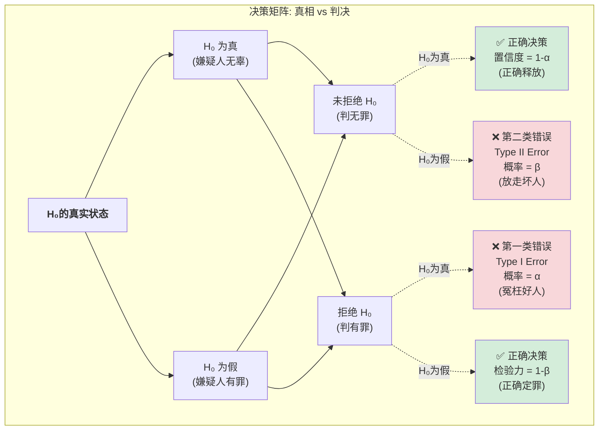
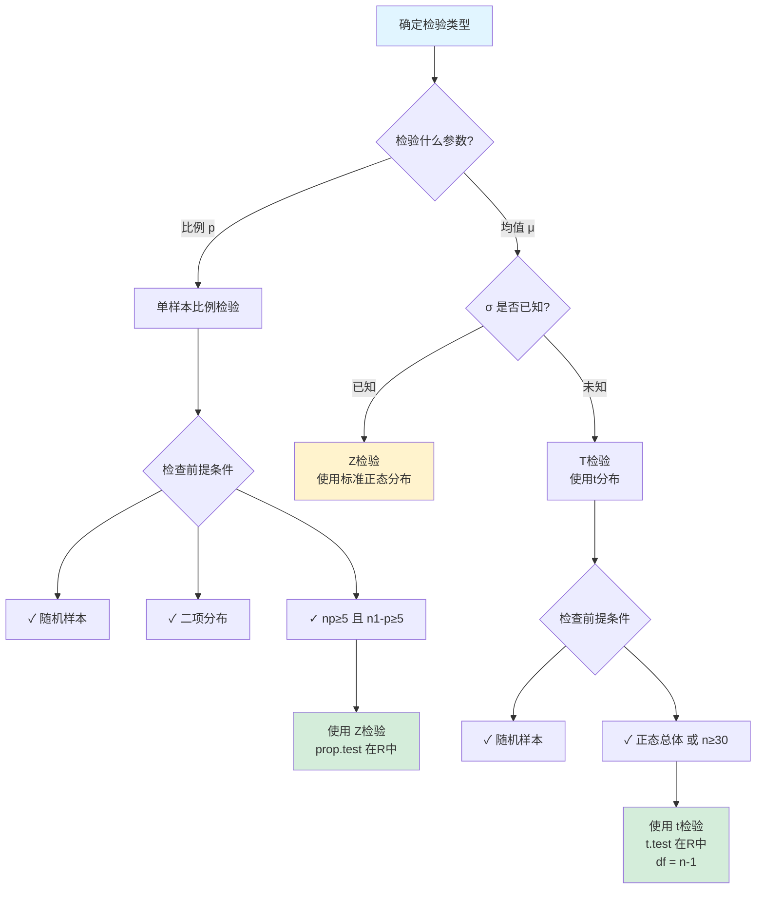
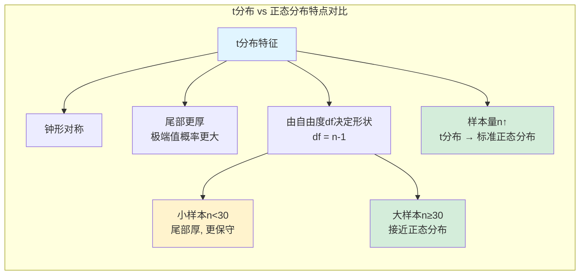

# 第七章：假设检验——数据侦探的法庭辩论指南

欢迎来到统计推断的核心——假设检验. 在这里, 我们将扮演“数据检察官”的角色. 我们的任务不再是简单地描述或估计, 而是要对一个关于总体的“断言” (claim) 提出挑战, 并用样本数据作为证据, 在“统计法庭”上进行一场严谨的辩论.

---

## 7.1 假设检验的基本逻辑

假设检验的本质是一种“反证法”. 我们不直接证明我们相信的事情, 而是先假设一个与之相反的立场是正确的, 然后试图证明这个立场是多么地荒谬可笑, 从而间接证实我们自己的观点.

#### “法庭”上的两个对立观点:

1.  **原假设 (Null Hypothesis, $H_0$)**: “嫌疑人是无辜的”. 这是我们要挑战的、代表“现状”或“旧有观念”的立场. 它总是包含“=”、“≤”或“≥”号. 在数学上, 我们通常只写等号.
    *   *例子*: 电池制造商声称“我们的电池平均能用500小时” ($H_0: Γ = 500$). 

2.  **备择假设 (Alternative Hypothesis, $H_a$ 或 $H_1$)**: “嫌疑人是有罪的”. 这是我们作为检察官想要证明的、代表“新发现”或“挑战”的立场. 它总是包含“≠”、“<”或“>”号.
    *   *例子*: 你作为消费者怀疑“电池的平均寿命**不等于**500小时” ($H_a: Γ 
e 500$). 

#### 辩论流程:

```mermaid
flowchart TD
    A[开始: 提出研究问题] --> B[步骤1: 设定假设<br/>H₀ vs Hₐ]
    B --> C[步骤2: 设定显著性水平<br/>α = 0.05]
    C --> D[步骤3: 收集样本数据<br/>计算统计量]
    D --> E[步骤4: 计算p值<br/>P证据 | H₀为真]
    E --> F{步骤5: 判决<br/>p值 < α ?}
    F -->|是| G[拒绝H₀<br/>✅ 支持Hₐ<br/>证据显著]
    F -->|否| H[未能拒绝H₀<br/>⚠️ 证据不足<br/>不能证明H₀正确]

    style A fill:#e1f5ff
    style G fill:#d4edda
    style H fill:#fff3cd
    style F fill:#f8d7da
```

1.  **提出指控**: 明确你的原假设($H_0$)和备择假设($H_a$).
2.  **设定底线**: 确定一个"判决标准", 称为**显著性水平 (Significance Level, $\alpha$)**. 这代表你愿意承担的"冤枉好人"的风险. 通常我们取 $\alpha = 0.05$ (5%).
3.  **收集证据**: 抽取一个随机样本, 并计算出样本的统计量(如样本均值 $\bar{x}$).
4.  **计算"惊奇指数" (p-value)**: 这是最关键的一步. 我们计算一个叫做 **p值 (p-value)** 的东西.
    *   **p值的含义**: **假设原假设($H_0$)是真的(即嫌疑人是无辜的), 我们收集到的这批证据(或比它更极端的证据)出现的概率有多大?**
    *   **比喻**: 如果嫌疑人真是无辜的, 那么我们在案发现场找到他指纹的概率有多大？如果这个概率非常非常小(p值很小), 我们就有理由怀疑"他是无辜的"这个前提.
5.  **做出判决**: 将"惊奇指数"与我们的"底线"进行比较.
    *   如果 **p-value < $\alpha$**: 证据足够"惊奇", 超出了我们的容忍底线. 我们**拒绝原假设 (Reject $H_0$)**. 裁定"备择假设"成立(嫌疑人有罪).
    *   如果 **p-value $\ge \alpha$**: 证据不够"惊奇", 在合理范围内. 我们**未能拒绝原假设 (Fail to reject $H_0$)**. 我们只能说"证据不足, 无法定罪", **但绝不代表我们证明了嫌疑人是无辜的!**

---

## 7.2 "法庭"上的两种误判 (Type I & Type II Error)

任何判决都有犯错的可能, 在统计法庭上也是如此:



*   **第一类错误 (Type I Error)**: **冤枉好人**. 即 $H_0$ 本是真的, 但我们却拒绝了它. 这个错误的发生概率就是我们自己设定的 $\alpha$.
    *   *后果*: 电池其实没问题, 但你却终止了合同, 可能会被制造商起诉.

*   **第二类错误 (Type II Error)**: **放走坏人**. 即 $H_0$ 本是假的, 但我们却没有拒绝它. 这个错误的发生概率用 $\beta$ 表示.
    *   *后果*: 电池其实有问题, 但你却相信了制造商, 最终卖给消费者的产品质量不达标, 公司信誉受损.

> **$\alpha$ 和 $\beta$ 的关系**: 在样本量固定的情况下, $\alpha$ 和 $\beta$ 就像跷跷板. 你想降低"冤枉好人"的风险(减小$\alpha$), 那么"放走坏人"的风险($\beta$)就会增加. 如何取舍, 取决于哪种错误的后果更严重.

---

## 7.3 针对不同"罪名"的检验方法

根据你要检验的参数不同(是均值还是比例), 我们使用不同的"法条".



#### 1. 单样本比例 Z检验 (One-Sample Proportion Z-Test)

*   **应用场景**: 检验一个总体的**比例 (proportion)** 是否等于某个值.
*   *例子*: "本校学生支持率是否显著高于全国的55%?"
*   **前提条件**:
    1.  样本是随机的.
    2.  满足二项分布的条件.
    3.  样本足够大, 使得"成功"和"失败"的期望次数都至少是5 (即 $np >= 5$ 且 $n(1-p) >= 5$). 这保证了样本比例的抽样分布近似正态.

**R实现示例**:
```r
# 例: 调查200名学生, 120人支持某提案
# H₀: p = 0.55 vs Hₐ: p > 0.55
prop.test(x = 120,           # 成功次数
          n = 200,           # 样本量
          p = 0.55,          # 原假设的比例
          alternative = "greater",  # 单尾检验: "two.sided", "less", "greater"
          conf.level = 0.95)       # 置信水平 (1-α)

# 提取p值
result <- prop.test(120, 200, p = 0.55, alternative = "greater")
result$p.value  # 若 < 0.05, 拒绝H₀
```

#### 2. 单样本均值 T检验 (One-Sample Mean T-Test)

*   **应用场景**: 检验一个总体的**均值 (mean)** 是否等于某个值, **且总体标准差 $\sigma$ 未知** (这在现实中是常态).
*   *例子*: "本校学生的平均身高是否显著不同于全国平均的175cm?"
*   **背景**: 由于 $\sigma$ 未知, 我们只能用样本标准差 $s$ 来估计它. 这个"不确定性"的引入, 使得我们不能再使用标准正态分布(Z分布), 而必须使用一个更"宽容"的分布——**学生t分布 (Student's t-distribution)**.



*   **t分布的特点**: 它和正态分布一样是钟形的, 但更"矮胖", 尾部更厚, 意味着它认为极端值更容易出现. 它的具体形状由**自由度 (degrees of freedom, df)**决定, 通常 df = n - 1. 样本量n越大, t分布越接近标准正态分布.
*   **前提条件**:
    1.  样本是随机的.
    2.  总体大致服从正态分布, **或者** 样本量足够大($n >= 30$). (中心极限定理保证了即使总体不正态, 样本均值的分布也是正态的).

**R实现示例**:
```r
# 例: 抽取25名学生, 测量身高数据
heights <- c(172, 178, 165, 180, 175, 169, 177, 173, 171, 176,
             174, 168, 179, 170, 175, 172, 177, 174, 176, 173,
             171, 175, 178, 172, 174)

# H₀: μ = 175 vs Hₐ: μ ≠ 175
t.test(heights,
       mu = 175,                    # 原假设的均值
       alternative = "two.sided",   # 双尾检验
       conf.level = 0.95)           # 置信水平

# 单尾检验示例: H₀: μ = 175 vs Hₐ: μ > 175
result <- t.test(heights, mu = 175, alternative = "greater")
result$p.value      # p值
result$statistic    # t统计量
result$parameter    # 自由度 df = n-1
```

**完整假设检验流程示例**:
```r
# 综合示例: 电池寿命检验
# 制造商声称电池平均寿命500小时, 抽取36个样本检验

battery_life <- c(498, 502, 495, 505, 490, 510, 492, 508, 497, 503,
                  501, 499, 496, 504, 493, 507, 500, 502, 498, 501,
                  495, 505, 499, 503, 497, 501, 500, 498, 502, 496,
                  504, 499, 501, 497, 503, 500)

# 步骤1-2: 设定假设和显著性水平
# H₀: μ = 500  vs  Hₐ: μ ≠ 500,  α = 0.05

# 步骤3-4: 计算统计量和p值
test_result <- t.test(battery_life, mu = 500, alternative = "two.sided")

# 步骤5: 做出判决
alpha <- 0.05
cat("p值 =", round(test_result$p.value, 4), "\n")
cat("判决: ", ifelse(test_result$p.value < alpha,
                     "拒绝H₀ (证据显著)",
                     "未能拒绝H₀ (证据不足)"), "\n")
```

---

> **总结**: 假设检验是一个标准化的六步流程. 掌握了这个"法庭辩论"的框架, 你就可以对任何声称的"事实"发起有理有据的挑战. 这是数据科学中最核心、最强大的技能之一.
