# 第八章：置信区间——为真相画一个范围

在上一章的“统计法庭”上, 我们学会了如何对一个断言做出“有罪”或“证据不足”的判决. 但很多时候, 我们不仅想知道一个说法是否错误, 更想知道“**那真相到底可能是什么?**”. 置信区间(Confidence Interval)就是回答这个问题的强大工具. 它不再给出一个非黑即白的判决, 而是为未知的总体参数(如总体均值 $\mu$ 或总体比例 $p$)画定一个合理的“藏身范围”.

---

## 8.1 置信区间的基本概念

#### 点估计 vs. 区间估计


*   **点估计 (Point Estimate)**: 用**一个单一的数值**去估计未知的总体参数. 比如, 我们用样本均值 $\bar{x}$ 来估计总体均值 $\mu$.
    *   **比喻**: 就像天气预报说"明天的最高气温将是25°C".
    *   **缺点**: 它几乎总是错的. 真实值恰好就是那个点的概率微乎其微. 而且, 它完全没有提供"误差"的信息.

*   **区间估计 (Interval Estimate)**: 提供一个**数值范围**, 并附上这个范围"捕获"到真实参数的可能性.
    *   **比喻**: 天气预报说"明天最高气温在23°C到27°C之间的可能性是95%". 这显然比"就是25°C"的说法更可靠、更有用.

这个带有"可能性"的区间, 就是**置信区间**. 它的通用形式是:

**置信区间 = 点估计 ± 边际误差 (Margin of Error)**

#### 如何解读置信区间?

这是一个非常关键且容易被误解的概念. 假设我们计算出一个"95%置信区间"是 [23, 27].


*   **正确的统计学解释**: "我们有95%的信心, 认为这个**区间**[23, 27]包含了真实的总体参数."
    *   **含义**: 这句话描述的是我们所构造的这个"区间"的可靠性. 如果我们重复抽样100次, 构造出100个这样的区间, 我们期望其中有95个区间能成功"捕获"到那个固定但未知的真实参数, 而有5个会"失手".

*   **错误的解释**: "真实的总体参数有95%的概率落在[23, 27]这个区间内."
    *   **为什么错**: 总体参数是一个**固定值**, 它要么在区间内, 要么在区间外, 没有概率可言. 变的是我们每次抽样构造出的那个"区间".

*   **通俗的现实世界解释**: "我们估计, 真实的总体参数值在23到27之间." (在非学术交流中, 这是最直接的沟通方式, 但要记住其背后的统计学含义).

#### 置信水平与区间宽度的权衡

```mermaid
graph TB
    subgraph "置信水平 vs 区间宽度"
        A[真实参数 μ]

        B["90% CI: [24, 26]<br/>窄但风险高"]
        C["95% CI: [23, 27]<br/>平衡"]
        D["99% CI: [21, 29]<br/>宽但更可靠"]

        A -.->|包含| B
        A -.->|包含| C
        A -.->|包含| D

        E[置信水平 ↑<br/>区间宽度 ↑]
        F[样本量 n ↑<br/>区间宽度 ↓<br/>置信水平不变]
    end

    style A fill:#e1f5ff
    style C fill:#d4edda
    style B fill:#fff3cd
    style D fill:#fff3cd
    style F fill:#d4edda
```




*   **置信水平 (Confidence Level)**: 你希望你的"网"有多可靠. 常用的有90%, 95%, 99%.
*   **权衡**: 提高置信水平, 就必须把"网"撒得更大(区间更宽), 这样才能更有把握地捕获到真相. 反之亦然.
    *   **99%置信区间** 会比 **95%置信区间** 更宽.
    *   **90%置信区间** 会比 **95%置信区间** 更窄.

*   **样本量的影响**: 增加样本量($n$), 能让我们在**不牺牲置信水平**的前提下, 把区间**变窄**. 因为更大的样本提供了更精确的信息, 我们的估计也更准.

---

## 8.2 常见的置信区间计算

计算置信区间的"法条"和假设检验类似, 同样取决于你要估计的参数类型和已知条件.


#### 1. 单样本比例置信区间 (Confidence Interval for a Proportion)

*   **应用场景**: 估计一个总体的**比例 (proportion)**.
*   *例子*: "本校学生中, 支持在线学习的真实比例大概在哪个范围?"
*   **前提条件**: 与比例的Z检验相同. (随机样本, 满足二项分布, 样本量足够大).

**R实现示例**:
```r
# 例: 调查200名学生, 120人支持在线学习
# 估计总体支持率的95%置信区间

result <- prop.test(x = 120,         # 成功次数
                    n = 200,         # 样本量
                    conf.level = 0.95)  # 置信水平

# 查看置信区间
result$conf.int
# 输出示例: [0.53, 0.67] 表示真实支持率在53%-67%之间

# 不同置信水平的对比
ci_90 <- prop.test(120, 200, conf.level = 0.90)$conf.int
ci_95 <- prop.test(120, 200, conf.level = 0.95)$conf.int
ci_99 <- prop.test(120, 200, conf.level = 0.99)$conf.int

cat("90% CI:", round(ci_90, 3), "\n")
cat("95% CI:", round(ci_95, 3), "\n")
cat("99% CI:", round(ci_99, 3), "\n")  # 最宽
```

#### 2. 单样本均值置信区间 (Confidence Interval for a Mean)

*   **应用场景**: 估计一个总体的**均值 (mean)**, 且总体标准差 $\sigma$ 未知.
*   *例子*: "本校大一新生的平均高考分数大概在哪个范围?"
*   **所用分布**: 同样使用**学生t分布**来处理因 $\sigma$ 未知而带来的不确定性.
*   **前提条件**: 与均值的T检验相同. (随机样本, 总体正态或样本量足够大).

**R实现示例**:
```r
# 例: 抽取25名学生的高考分数
scores <- c(620, 635, 610, 645, 625, 618, 640, 628, 615, 638,
            630, 622, 642, 617, 633, 627, 639, 631, 636, 629,
            621, 634, 641, 626, 632)

# 计算95%置信区间
result <- t.test(scores, conf.level = 0.95)

# 查看结果
cat("样本均值:", round(mean(scores), 2), "\n")
cat("95% CI:", round(result$conf.int, 2), "\n")
# 输出示例: 95% CI: [625.3, 633.7]
# 解释: 我们有95%的信心, 总体平均分在625.3到633.7之间

# 对比不同置信水平
ci_90 <- t.test(scores, conf.level = 0.90)$conf.int
ci_95 <- t.test(scores, conf.level = 0.95)$conf.int
ci_99 <- t.test(scores, conf.level = 0.99)$conf.int

cat("90% CI:", round(ci_90, 2), "宽度:", round(diff(ci_90), 2), "\n")
cat("95% CI:", round(ci_95, 2), "宽度:", round(diff(ci_95), 2), "\n")
cat("99% CI:", round(ci_99, 2), "宽度:", round(diff(ci_99), 2), "\n")
```

**样本量对置信区间宽度的影响演示**:
```r
# 演示样本量如何影响置信区间宽度
set.seed(123)  # 固定随机种子, 结果可重复

# 模拟不同样本量
sample_sizes <- c(10, 30, 50, 100, 200)
results <- data.frame()

for (n in sample_sizes) {
  # 从正态分布抽样
  sample_data <- rnorm(n, mean = 500, sd = 20)
  ci <- t.test(sample_data)$conf.int
  width <- diff(ci)

  cat("n =", sprintf("%3d", n),
      "| 95% CI: [", sprintf("%6.2f", ci[1]), ",", sprintf("%6.2f", ci[2]), "]",
      "| 宽度:", sprintf("%5.2f", width), "\n")
}

# 关键发现: 样本量增加, 区间宽度减小
# n=10: 宽度约30-40
# n=200: 宽度约5-8 (减少约75-80%)
```

---

## 置信区间与假设检验的关系


置信区间和双侧假设检验是同一枚硬币的两面. 对于一个假设检验 $H_0: \mu = 500$ vs $H_a: \mu \ne 500$, 在 $\alpha=0.05$ 的显著性水平下:

*   如果对应的 **95%置信区间** **不包含** 500 (例如 [505, 515]), 那么假设检验的结果就是**拒绝$H_0$**.
*   如果对应的 **95%置信区间** **包含了** 500 (例如 [495, 505]), 那么假设检验的结果就是**未能拒绝$H_0$**.

**R实现示例 - 验证两者等价性**:
```r
# 例: 电池寿命数据, H₀: μ = 500
battery_life <- c(498, 502, 495, 505, 490, 510, 492, 508, 497, 503,
                  501, 499, 496, 504, 493, 507, 500, 502, 498, 501,
                  495, 505, 499, 503, 497, 501, 500, 498, 502, 496,
                  504, 499, 501, 497, 503, 500)

# 方法1: 假设检验
test_result <- t.test(battery_life, mu = 500)
cat("假设检验 p值:", round(test_result$p.value, 4), "\n")
cat("结论:", ifelse(test_result$p.value < 0.05,
                  "拒绝H₀", "未能拒绝H₀"), "\n\n")

# 方法2: 置信区间
ci <- test_result$conf.int
cat("95% 置信区间: [", round(ci[1], 2), ",", round(ci[2], 2), "]\n")
cat("是否包含 μ₀=500?", ifelse(500 >= ci[1] & 500 <= ci[2],
                              "是 (未能拒绝H₀)", "否 (拒绝H₀)"), "\n\n")

# 可视化对比
mu0 <- 500
cat("--- 等价性验证 ---\n")
cat("CI包含μ₀:", (500 >= ci[1] & 500 <= ci[2]), "\n")
cat("p值≥0.05:", test_result$p.value >= 0.05, "\n")
cat("两者结论:", ifelse((500 >= ci[1] & 500 <= ci[2]) ==
                        (test_result$p.value >= 0.05),
                        "✅ 一致", "❌ 不一致"), "\n")
```

> **侦探的视角**: 假设检验告诉你"嫌疑人(旧理论)是否有罪", 而置信区间则直接告诉你"真凶(真实参数)可能藏身的范围". 显然, 后者提供了更丰富的信息, 这也是为什么现代统计学越来越推崇使用置信区间的原因.

掌握了置信区间, 你就从一个只能做"是/否"判断的初级侦探, 升级为能够为真相划定一个具体、量化范围的高级分析师了. 这是统计推断中极其实用和强大的工具.
